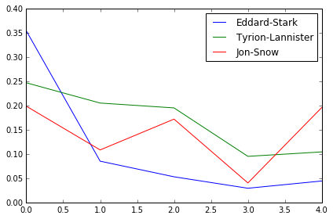
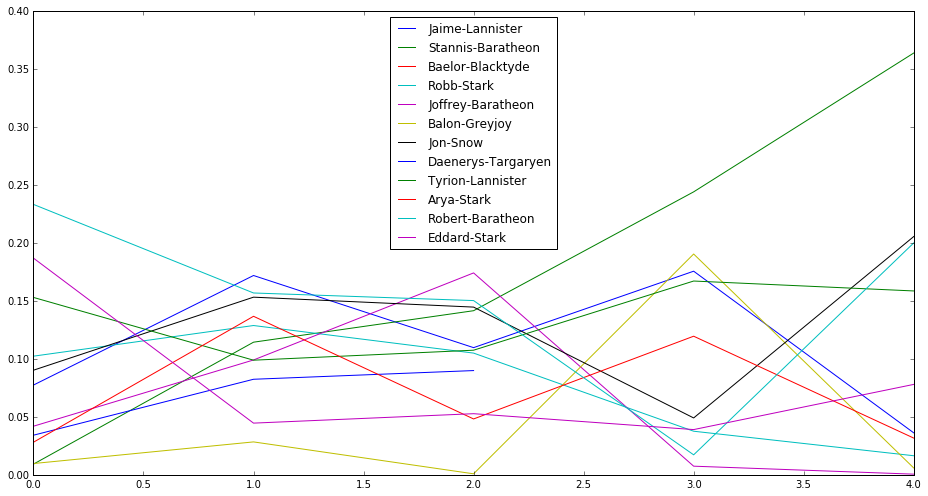
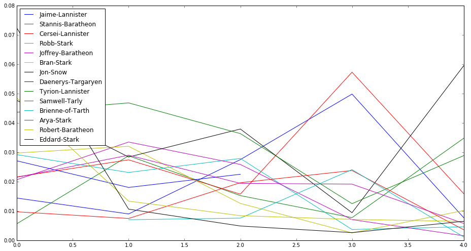

# game-of-thrones
Shows the character co-occurrence network and its evolution over the five books in R.R. Martin’s hugely popular book series A Song of Ice and Fire (perhaps better known as the TV show Game of Thrones) using networkX.

 
You will look at how the importance of the characters changes over the books using different centrality measures.

## Output 

  

  

  

